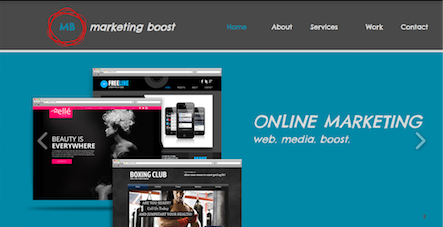

## ABOUT ME

Hi, my name is Stav Setty and I am currently a junior at the [University of Georgia](http://www.uga.edu) studying [Management Information Systems](http://www.terry.uga.edu/undergraduate/majors/management-information-systems) as well as the Entrepreneurship certificate program. 

## PROJECTS
Some projects I have worked on: 
- School projects 
  - Weebly, WIX, Wordpress, Sketch   
- One of my first basic experiences with web design -- I designed a website (not currently active) for a small marketing business 

- Designed an SQL database for hotel business 

## MISCELLANOUS  

- Designed a thousand t-shirts for University-wide pro-Israel event 

## OTHER SKILLS 
- Proficiency in SQL 
- Some HTML, CSS and Java 

## CONTACT ME
Feel free to email me with any questions you may have or just to say hello! 

ss92090@uga.edu 

[linkedin](https://www.linkedin.com/in/stavsetty/) 

