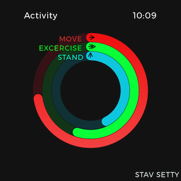

## ABOUT ME

Hi, my name is Stav Setty and I'm a third year student at the [University of Georgia](http://www.uga.edu) studying [Management Information Systems](http://www.terry.uga.edu/undergraduate/majors/management-information-systems) (MIS) as well as the Entrepreneurship certificate program. 

I'm passionate about the <b>intersection</b> between  <b>business</b> and <b>technology</b> :sparkles:

## SKILLS 
- Proficiency in SQL 
- Basic HTML, CSS and Java 
- Strong technical accumen 

## MY WORK
- Currently working on responsive website with HTML for [Bluejay App](http://bluejay-app.com/#) releasing soon
- Worked on family jewelry business, [Setty Gallery](http://www.settygallery.com)
- School projects 
  - Sketch
    - UI elements: [Sketch login form](http://imgur.com/a/jcT32) 
    - [Apple watch activity rings](http://imgur.com/a/nZTUE) 
  - Designed a [mock SQL database](http://share.pho.to/Ah2fd) for UGA Sustainability and Athens hotel business 
  - Weebly, Wix, Wordpress experience  
- Video production: currently working on Bar Mitzah video, past projects: [Bar Mitzvah project](https://www.youtube.com/watch?v=ReIv-pZ4ONY), [Israeli Scouts](https://drive.google.com/file/d/0BxAY6kprDtmbV3JhUm9qZHItRW8/view?usp=sharing)

## MISCELLANEOUS  

- I [designed a thousand t-shirts](https://ibb.co/g7g8O5) for university-wide pro-Israel event (on small budget) 

## CONTACT ME
Feel free to [email](mailto:stavsetty@gmail.com) me with any questions you may have or just to say hello! 

[stavsetty@gmail.com](mailto:stavsetty@gmail.com)

[linkedin](https://www.linkedin.com/in/stavsetty/)

